# myTeam Stats

## Description

Welcome to the MyTeam sports stats tracker for youth leagues, adult rec teams, and school sports! Whether you're a coach of a professional team looking to track the teams and players of a whole league, a player/manger corralling of an adult recreation team, a rec league admin building a season of teams, or an enthusiastic parent tracking their young athlete's progression through youth sports, myTeam Stats is the best way to manage anything from players on a team to multiple leagues running multiple seasons.

Check out the readme below and then use the live app via the Heroku button below!

[](https://myteam-stats.herokuapp.com/)

## Table of Contents

1. [Installation](#installation)
2. [Usage](#usage)
3. [Contributing](#contributing)
4. [User Story](#user-story)
5. [Screenshots](#screenshots)
6. [Planning](#Planning)
7. [Github](#github)

## Installation

When accessing the backend of this app deployed on Heroku, you can run `npm i` to install dependencies. If you'd like seeds to see some examples of the application in action use the script `npm run seed`, otherwise, this application is all hooked up and ready to go!

## Usage

Never lose track of your team stats again! Users can view their favorite leagues, teams, and players. Signup to be an admin of your own league so you can add players, teams, leagues, and select the season. Add games to keep score and see where your team stands in the running!

## Contributing

This application was built by Juanita Samborski, Christina Bohn, Nick Edwards, and Chandra Holt.

## User Story

```md
AS A sports fan
I WANT an application to track statistics of my favorite teams
SO THAT I can enjoy the season while watching my team advance
```

## Screenshots

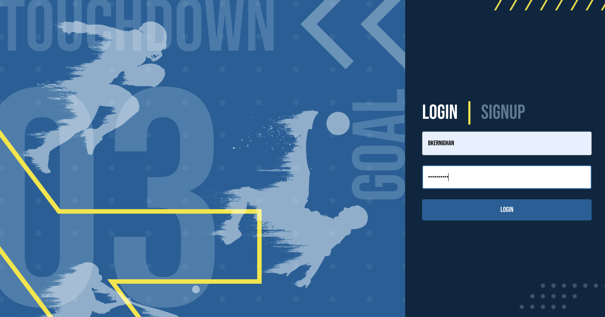
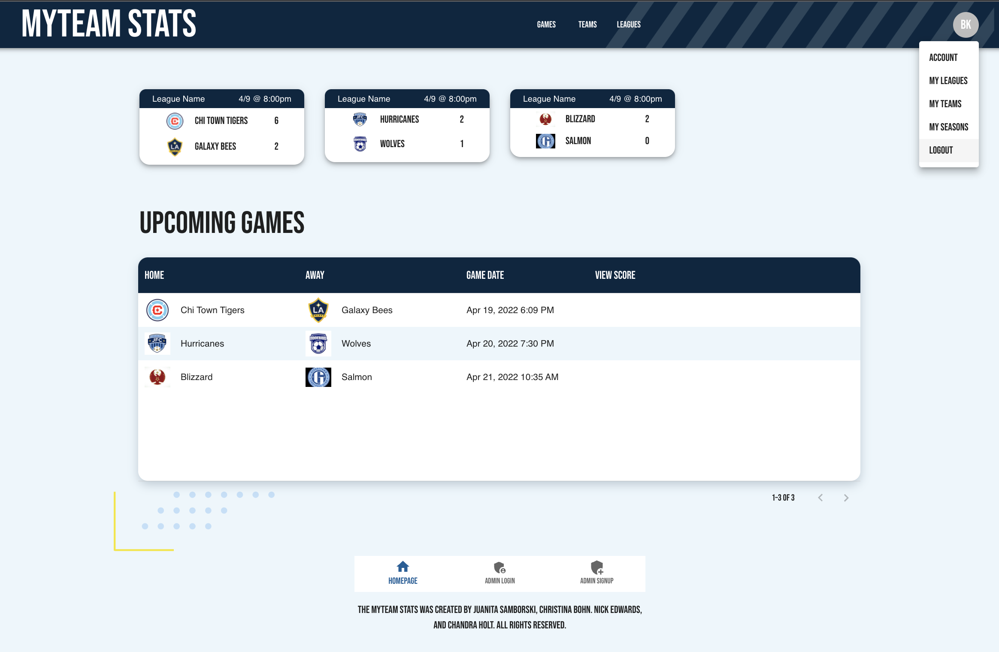

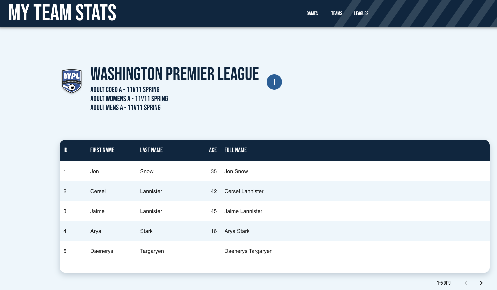
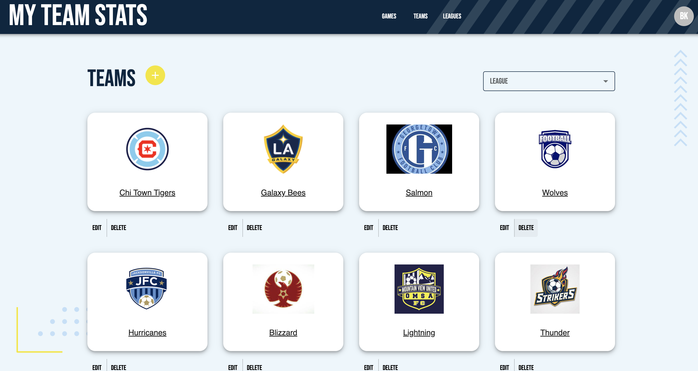
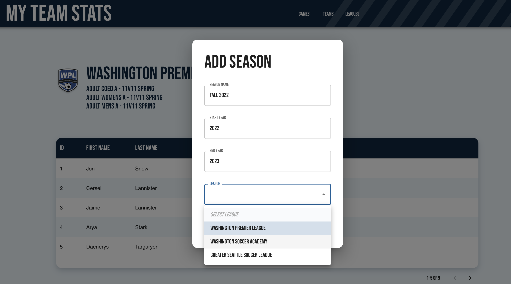

## Planning

Once the team settled on an idea for an application Nick volunteered to be begin planning the data structure. First drafts of the models and page contents were sketched out with pen and paper.
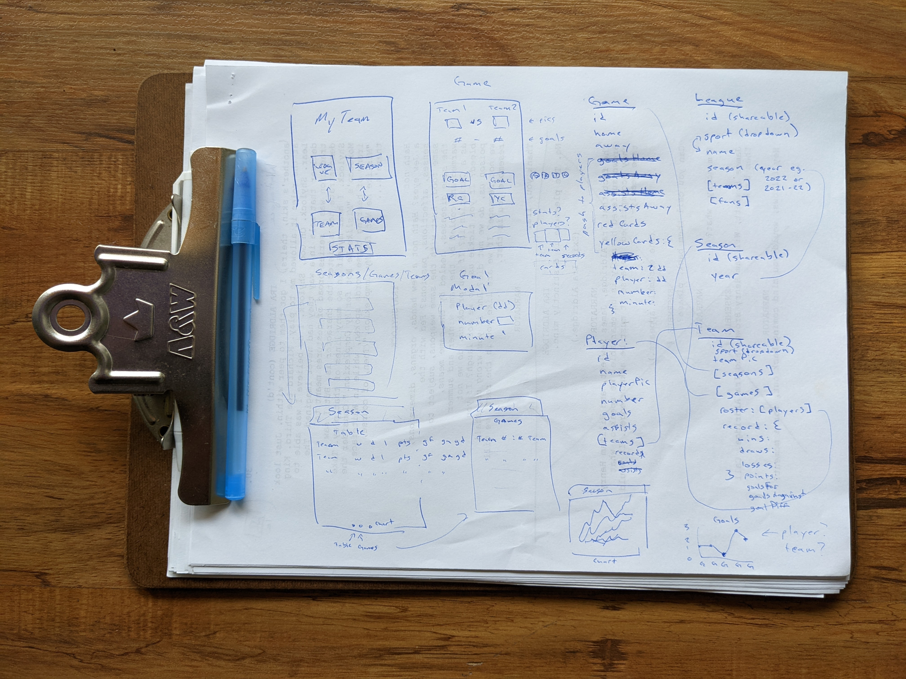

With rough ideas on paper, Nick set to work creating wireframes and user workflows in a drawio to share with the team. The data was beginning to take shape and with it somoe of the UX! You can view Nick's initial drawio at [https://drive.google.com/file/d/1nBEIIPUQKrH8zzbBEtpmvnY23NpBL6GU/view?usp=sharing](https://drive.google.com/file/d/1nBEIIPUQKrH8zzbBEtpmvnY23NpBL6GU/view?usp=sharing)

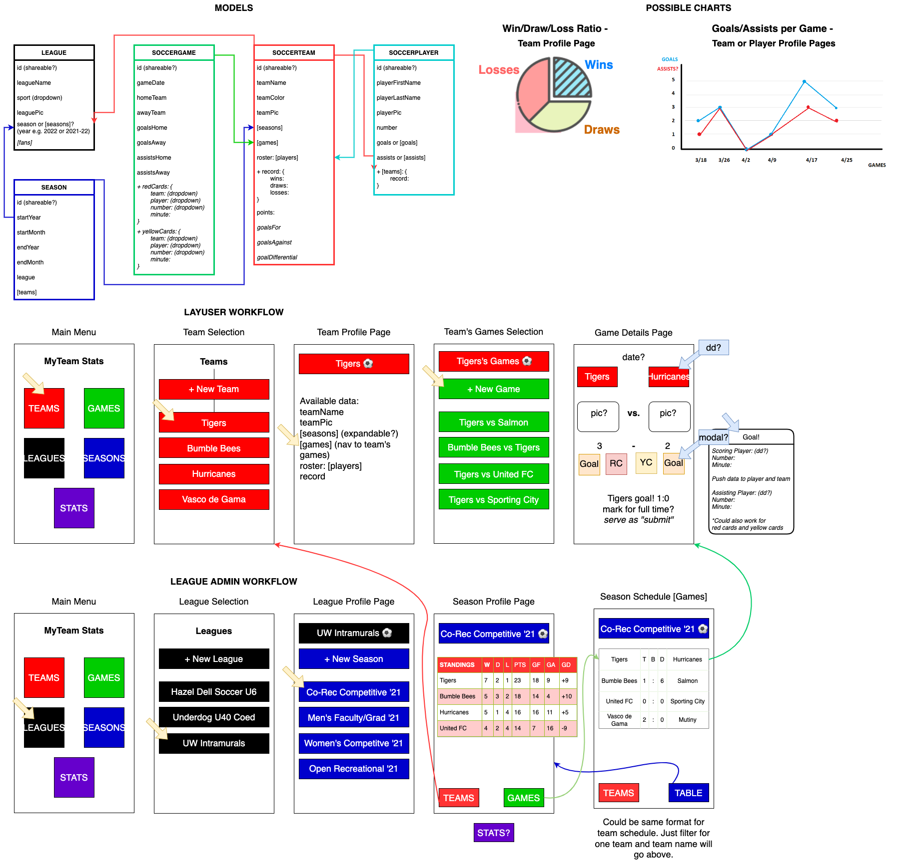

 
You can explore how the data works in this shared collectionof queries and mutations using Apollo: [https://studio.apollographql.com/graph/myTeam-Stats/explorer?collectionId=f0823736-7450-4877-91da-ad219e6d224e&focusCollectionId=f0823736-7450-4877-91da-ad219e6d224e&overlay=view-collection-details&variant=current](https://studio.apollographql.com/graph/myTeam-Stats/explorer?collectionId=f0823736-7450-4877-91da-ad219e6d224e&focusCollectionId=f0823736-7450-4877-91da-ad219e6d224e&overlay=view-collection-details&variant=current)

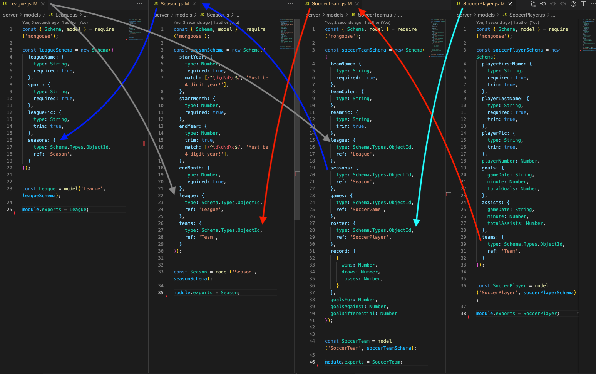

Juanita took all these backend ideas and began to craft a rich, styled, intuitive user expereince.
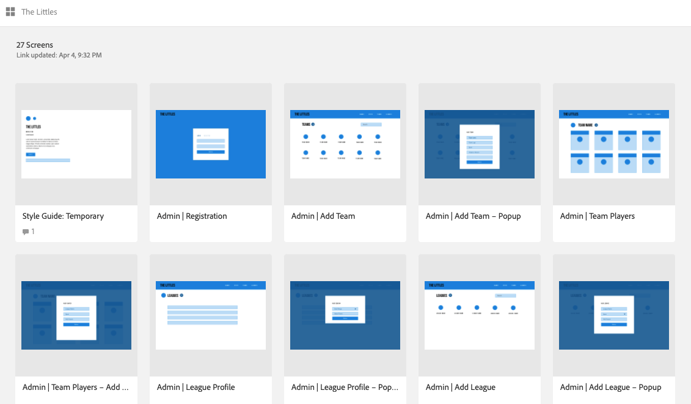
You can view more of the first draft of the styled application at [https://xd.adobe.com/view/cdb4683e-6730-41cb-84fa-6bd51488d89c-98e7/](https://xd.adobe.com/view/cdb4683e-6730-41cb-84fa-6bd51488d89c-98e7/)

Asana was critical to our project managment process. Tasks were frontloaded and updated as idenitfied. We've got big plans for future development!
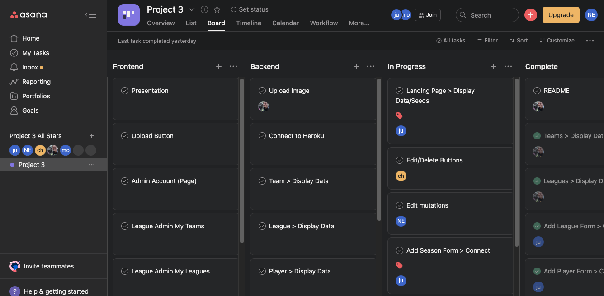

A glimpse of Juanita's final design.
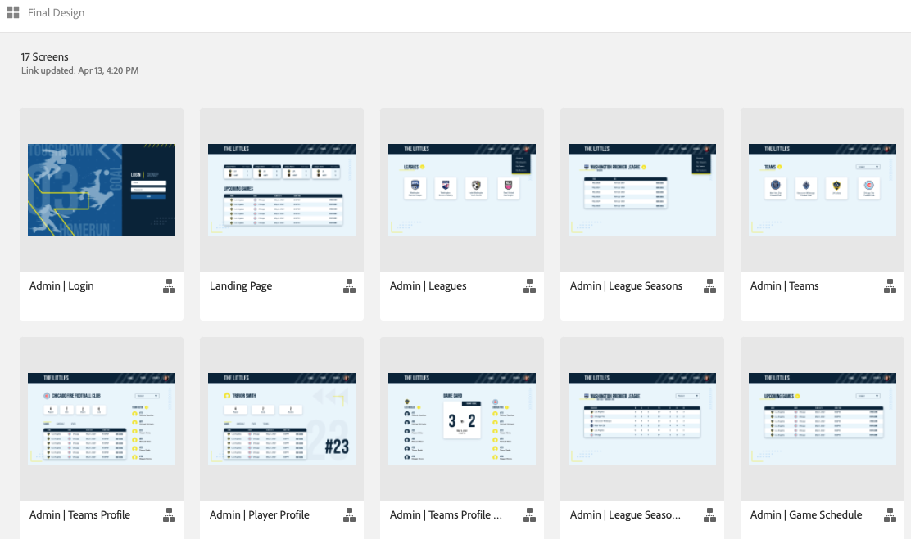
More available at [https://xd.adobe.com/view/e81ef607-7c65-445b-a38a-b2e1b48b1d4b-bd4d/grid](https://xd.adobe.com/view/e81ef607-7c65-445b-a38a-b2e1b48b1d4b-bd4d/grid).

### GitHub

URL for GitHub repo: [https://github.com/thenickedwards/My-Team-Stats-Tracker](https://github.com/thenickedwards/My-Team-Stats-Tracker)

[Juanita's GitHub](https://www.github.com/jsamborski310),
[Nick's GitHub](https://www.github.com/thenickedwards),
[Christina's GitHub](https://www.github.com/ChristinaBohn),  
[Chandra's GitHub](https://www.github.com/chandrapanda)

## Heroku

URL for live application deployed on Heroku: [https://myteam-stats.herokuapp.com/](https://myteam-stats.herokuapp.com/)

Thank you for reading the readme! Enjoy an orange slice and Capri-Sun 🍊🧃

[](https://www.gnu.org/licenses/lgpl-3.0)
