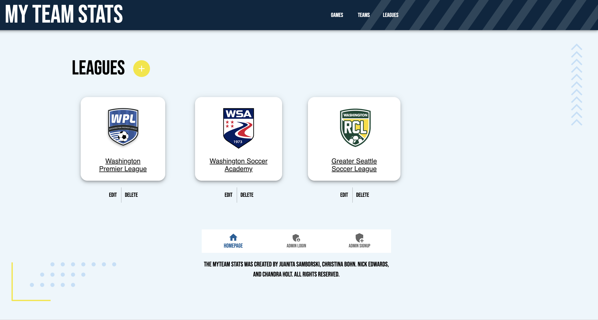

# My-Team-Stats-Tracker

## Description

Welcome to the MyTeam sports stats tracker for youth leagues, adult rec teams, and school sports!

Check out the readme below and then use the live app using the Heroku button below!

[](https://myteam-stats.herokuapp.com/)

## Table of Contents

1. [Installation](#installation)
2. [Usage](#usage)
3. [Contributing](#contributing)
4. [User Story](#user-story)
5. [Screenshots](#screenshots)
6. [Planning](#Planning)
7. [Github](#github)

## Installation

When accessing the backend of this app deployed on Heroku, you can `npm i` to install dependencies. Otherwise, this application is all hooked up and ready to go!

## Usage

Never lose track of your team stats again! Users can view their favorite leagues, teams, and players. Signup to be an admin of your own league so you can add players, teams, leagues, and select the season. Add games to keep score and see where your team stands in the running!

## Contributing

This application was built by Juanita Samborski, Christina Bohn, Nick Edwards, and Chandra Holt.

## User Story

```md
AS A sports fan
I WANT an application to track statistics of my favorite teams
SO THAT I can enjoy the season while watching my team advance
```

## Screenshots





## Planning


### GitHub
[URL for GitHub repo: https://github.com/thenickedwards/My-Team-Stats-Tracker](https://github.com/thenickedwards/My-Team-Stats-Tracker)

[Juanita's GitHub](https://www.github.com/jsamborski310),
[Nick's GitHub](https://www.github.com/thenickedwards),
[Christina's GitHub](https://www.github.com/ChristinaBohn),  
[Chandra's GitHub](https://www.github.com/chandrapanda)

## Heroku
[URL for live application deployed on Heroku: https://myteam-stats.herokuapp.com/](https://myteam-stats.herokuapp.com/)


Thank you for reading the readme!

[](https://www.gnu.org/licenses/lgpl-3.0)